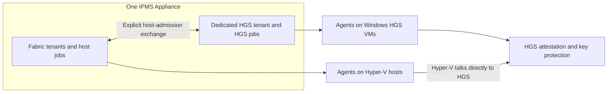

<!--
File Name: HGS-DEPLOYMENT-PROPOSAL.md
Version: v0.2.0 | Created: 2026-09-19 | Last Modified: 2026-09-20
Author: Alice Endelgard | Organization: Alvestrasza Corporation
Description: Proposed single-Appliance HGS provisioning with a dedicated tenant and two VM protection profiles.
-->
# Agent-assisted Host Guardian Service deployment

Status: Original proposal, followed by the source implementation in Portal 0.2.76
and Windows Agent 0.2.49. [ADR-0019](ADR-0019-HGS-PROVISIONING.md) and the
[operations runbook](../operations/HGS-DEPLOYMENT.md) define the implemented scope
and supersede proposal-only provider gaps below. Live fabric acceptance remains
outstanding. One Appliance, a dedicated HGS tenant and both profiles are required.

## Outcome and scope

An administrator prepares existing Windows Server VMs, enrolls their IPMS Agents
in a tenant used exclusively for HGS, and creates a reviewed deployment plan.
IPMS then coordinates the supported HGS steps, planned reboots and verification.
One IPMS Appliance must support both the fabric tenants and the HGS tenant,
including both protection profiles. A second Appliance is not a prerequisite.
Windows HGS services run on the selected Windows VMs, not inside the Linux IPMS
Appliance. The number of HGS nodes is independent of the number of Appliances.

The initial implementation increment provisions HGS for the selected protection
profile. Registering hosts and applying VM protection are distinct jobs. Neither
provisioning HGS nor selecting a profile silently converts existing workload VMs.

VM creation and automatic removal from an existing domain are excluded. Start
with a one-node lab pilot and extend to a three-node production topology after
recovery and failure acceptance. A lab success is not production HA acceptance.

## Two VM protection profiles

| Property | Simple operation: vTPM only | Secure operation: shielded VMs |
| --- | --- | --- |
| User-visible goal | Provide a vTPM for guest TPM-dependent features | Protect VM secrets/state from fabric administrators under the supported guarded-fabric model |
| VM configuration | Generation 2, vTPM enabled, shielding disabled | Generation 2, vTPM and shielding enabled, required guest and host protections verified |
| Guest disk encryption | Separate observed/configured state; enabling vTPM does not itself enable BitLocker | Required encryption and recovery prerequisites must pass before acceptance |
| HGS use | Central key protection where selected | Required for this IPMS secure deployment profile |
| Host attestation | Host-key attestation is the proposed simpler HGS option; an existing TPM-attested deployment is also compatible | TPM-trusted attestation with approved boot and code-integrity evidence |
| Host administrator trust | Host administrators remain trusted | Host administrators are outside the intended VM confidentiality boundary; HGS/IPMS authorities remain trusted |

These are VM protection profiles, not aliases for HGS attestation modes. The
Portal shows VM profile, key-protector source, guest encryption evidence and
HGS attestation mode as separate facts. An encryption-supported VM also has
settings beyond merely enabling vTPM; the Portal must not infer that complete
state from a vTPM flag.

Local vTPM with a local key protector is possible without HGS, as already noted
in ADR-0001. If offered within the simple profile, label the key source as local
and skip HGS deployment; do not advertise centralized key release. HGS-backed
vTPM is the relevant choice for the requested centralized HGS workflow. Any HGS
deployment uses the dedicated HGS tenant. Test key-protector portability before
allowing migration or recovery on another host; never replace a protector as an
automatic repair of an existing encrypted guest.

An HGS deployment uses one attestation mode. A TPM-attested deployment can serve
both unshielded vTPM/encryption-supported VMs and shielded VMs on eligible hosts.
If simple hosts need host-key attestation while secure hosts use TPM attestation,
model separate HGS deployments; one IPMS Appliance and the dedicated HGS tenant
can manage both. Never switch a cluster's attestation mode implicitly to satisfy
a VM-profile selection. Upgrading an existing VM to the secure profile requires
a new reviewed plan, compatibility checks, recovery proof and explicit execution.

## Current foundation and missing behavior

The inspected committed base is `7c015d84b58557632ce5e877e1c8c535a6e28028`
(Portal 0.2.73, Windows Agent 0.2.48). This is source evidence, not a fresh fleet
or Appliance verification. Other work may independently advance the checkout.

| Area | Existing foundation | Required HGS work |
| --- | --- | --- |
| Agent installation | Bounded Windows bootstrap and mTLS enrollment | Validate enrollment and reconnect through HGS domain promotion |
| Tenant identity | Tenant-owned PKI policy, issuers, gateway identity and enrollments | HGS-only tenant purpose and capability restrictions |
| Authorization | Server-side tenant checks and exact GPO approvals | HGS plan, operation and host-admission authorization |
| Execution | Native fixed workers for Hyper-V and GPO operations | Reviewed HGS provider and compiled capability contract |
| Job recovery | Durable intent, receipts and reconciliation patterns | Multi-node, reboot-aware HGS state machine |
| Inventory | Windows roles/features and hardware inventory | HGS-specific readiness, configuration and health evidence |

The compiled pack registry and gateway message enum contain no HGS deployment
capability. A new Management Pack alone cannot add executable functionality.
An Agent release and matching Control Plane/Gateway receiver are required.

## Dedicated tenant and trust boundaries

The HGS tenant owns only HGS nodes and their management dependencies. It has its
own administrator principals, enrollments, Agent PKI policy, credentials, plans,
jobs and audit records. Creating a tenant does not itself create or register its
PKI/Gateway trust; that setup remains an explicit prerequisite.

The proposed backend tenant purpose is `hgs`. Enforce it at enrollment,
assignment, execution claim and artifact delivery, not only in navigation.
Ordinary Windows inventory, Agent lifecycle and the bounded HGS capabilities are
permitted. General Hyper-V workload administration and unrelated production GPO
operations are excluded. Changing tenant purpose must not bypass outstanding
jobs, existing authority or the enrollment ownership boundary.

Guarded Hyper-V hosts remain in their existing fabric tenants. An HGS tenant is
not a Microsoft Entra tenant, an AD forest or a substitute for either. Use a new
dedicated HGS forest in the first provisioning topology. A supported existing
bastion forest can be a later explicitly selected profile; never silently reuse
the fabric forest.

This separates application-level authority. As already documented in ADR-0017,
a shared Control Plane, database, Gateway and privileged Agent-update path
remain a common trust boundary. Separate tenant certificates do not isolate
their custodians when the same privileged operator controls both environments.
The required single-Appliance topology intentionally trusts that Appliance for
both tenants. Do not describe this as protection against compromise of the
Appliance itself. Independent execution, PKI and update administration may be
an optional stronger topology, but cannot be an installation requirement or a
feature gate for either protection profile. Enforce tenant isolation within the
single-Appliance product and document its actual shared trust boundary.

After provisioning, ordinary host attestation and key release must flow directly
between Hyper-V and HGS without a Portal approval or IPMS callback. Loss of the
Appliance suspends new management jobs; it must not by itself disable HGS or
prevent otherwise-authorized VM starts. Verify this with the Appliance stopped,
while HGS, DNS, time and other required infrastructure remain available. One
Appliance still has a management availability limitation, separately reported.

HGS VMs must also be hosted under an appropriately separate administrative
boundary. A separate guest tenant does not protect an ordinary HGS VM from its
underlying Hyper-V host administrator. Inventory placement, backup authority
and cold-start dependencies before accepting the topology. Avoid a cycle in
which the sole HGS or its sole management/recovery system needs that same HGS
to start.

## Administrator workflow

| Stage | Automated behavior to implement | Required operator input |
| --- | --- | --- |
| Enroll | Verify selected Agents, tenant, identity and minimum version | Existing VMs and dedicated HGS tenant |
| Inspect | Read OS, domain membership, installed roles, DNS/time, network, restart state, storage and HGS state | Confirm administrative placement and independent recovery |
| Plan | Generate exact targets, dependencies, changes and verification steps | VM protection profile, compatible HGS mode, forest/service names, nodes, PKI references and maintenance window |
| Provision | Install the HGS role, create the dedicated forest, initialize HGS, then join additional nodes | Review and authorize the concrete plan including its reboots |
| Verify | Collect fresh service, replication, endpoint, certificate and per-node evidence | Resolve external PKI or recovery tasks identified by the plan |
| Admit hosts | Coordinate exact host evidence and client configuration across tenants | Separate authorization by each tenant for its own action |

For the new-forest profile, domain-joined VMs fail preflight. Do not
automatically unjoin or repurpose an existing domain controller. HGS roles may
run on Standard or Datacenter; guarded Hyper-V hosts require Datacenter.
TPM 2.0, UEFI/Secure Boot and measured host policies apply to TPM-trusted guarded
hosts. Do not impose them on a host-key deployment or misreport them as identical
guest-VM requirements. Local-vTPM eligibility is checked separately from HGS
guarded-host requirements.

A reviewed plan may authorize multiple bounded stages and planned reboots;
normal progress should not require repeatedly approving the same unchanged
intent. Any target, policy, identity, secret-reference or planned-action change
invalidates the applicable approval. Expired authority is never renewed by a
worker. Optional four-eyes policy remains distinct from the requirement that
each tenant authorize its side of an exchange.

## Execution provider and capability contract

Proposed operation families include readiness inspection, role installation,
forest creation, node joining, HGS initialization, certificate binding,
attestation-policy registration and health verification. Each is a fixed
operation with a bounded schema; no operator-provided command, script, query,
executable path, module path or arbitrary URL is accepted.

Microsoft documents HGS installation through `Install-WindowsFeature`,
`Install-HgsServer` and `Initialize-HgsServer`. A supported native C++ provider
covering this sequence has not been established by this review. Provider
feasibility is therefore the first implementation gate. Prefer documented
native/CIM interfaces where supported. If a packaged local adapter to named
Microsoft cmdlets is necessary, specify that exception in a dedicated ADR and
prove its bounded input, dependency, execution and output contract before use.
The existing Agent contract must not silently become a PowerShell bridge.

An adapter must ship as a reviewed, versioned release component; it cannot be
downloaded as an executable Management Pack. Use an isolated worker so domain
promotion, feature installation or replication waits do not block heartbeat.
The Control Plane stores durable plans and outcomes; the Agent executes and
verifies only locally applicable steps.

Reuse approval and journal patterns, not the existing GPO operation identifier
or schema. Bind every claim to tenant, enrolled device, plan revision/digest,
step, expected observed state, provider version, artifact identity and expiry.
The Agent rechecks these bindings immediately before mutation. Unsupported
Agents report an explicit capability gap and cannot receive a write assignment.
Deploy the receiver before compatible Agents and enable the capability only
after both sides have passed contract acceptance.

## Reboots, uncertain outcomes and recovery

Proposed plan states are `draft`, `inspecting`, `ready`, `awaiting_approval`,
`running`, `waiting_for_reboot`, `verifying`, `succeeded`, `failed`,
`cancelled` and `reconciliation_required`.

Persist protected write intent before each state-changing call. Record the
reboot expectation before restarting and use the same enrolled device identity
when it reconnects. A changed DNS suffix is not permission to move tenants,
replace identity or accept a different machine. Test certificate persistence,
service startup, DNS and firewall reachability through domain promotion.

Reconnection begins with fresh inspection. If the intended postcondition is
proven, record completion without replaying the write. If no write occurred and
the still-authorized step is demonstrably safe, resume it. Otherwise fence the
step for reconciliation. A lost reply must not create another forest, initialize
a second cluster or repeat certificate/key creation.

Serialize dependent node changes. Verify the primary before adding other nodes,
and avoid simultaneous restarts that remove all required authority. A cancelled
plan prevents new work but cannot undo an already accepted Windows operation.

Do not promise transactional rollback of AD promotion, cluster membership or
trust registration. Keep HGS configuration and independently protected recovery
material, define explicit repair procedures, and rehearse cold start and restore.
VM checkpoints alone are not the recovery plan.

## Cross-tenant host admission

The fabric tenant collects evidence for selected local hosts and requests
admission to one explicitly identified HGS deployment. The HGS administrator
reviews the exact TPM identity, measured boot baseline and code-integrity policy
before an HGS-local registration job is authorized in secure mode. A simple
host-key deployment instead registers the exact reviewed public host key and
must not report TPM health assurance. The fabric tenant separately authorizes
HGS client configuration on its own hosts.

Exchange versioned, bounded artifacts with exact hashes, origin/target binding,
expiry and policy revision. Neither side can select or execute jobs on the other
tenant's Agents, enumerate the other tenant's general inventory, retrieve its
credentials, or reuse its approvals. Do not automatically trust every Agent or
every host that appears in a Device Collection. Revoke pending admissions when
their source identity or policy changes.

For the first release, explicitly reviewed export/import is a valid
semi-automated handoff. A later portal broker must preserve both authorizations;
it must not widen ordinary tenant APIs into a general cross-tenant channel.
Independent instance isolation additionally requires independently trusted
artifact authentication. Current mTLS job delivery alone does not establish it.

## Secrets, releases and disconnected operation

Keep HGS signing/encryption private keys on their authorized nodes or HSM.
Persist only public identities, thumbprints and bounded verification results in
ordinary job records. DSRM, join credentials and any protected certificate
replication use purpose-specific secret references and short-lived local access;
never payload text, command lines, transcripts or logs. Keep recovery custody
independent from the only running Portal/HGS instance. Each node must prove
usable key access; a replicated public certificate alone is insufficient.

Use approved local Windows feature sources, Agent packages, TPM vendor
certificates and PKI validation endpoints. Validate package identity and pin
dependencies before crossing the air gap; installation must not fall back to
Internet downloads. Test offline certificate renewal, update and repair paths.

The existing development Agent lifecycle uses authenticated, hash-bound
artifacts; independent signed manifests, Authenticode and additional customer
release gates are still documented as incomplete in ADR-0006. Do not describe
those properties as already delivered or use a Management Pack signature as a
substitute. Privileged HGS execution and Agent updates need an explicit release
and update-trust assessment before production use.

## Implementation increments and acceptance

1. Read-only readiness and planning: one-Appliance tenant routing, HGS-only tenant
   restrictions, both VM protection profiles, inventory, topology checks, exact
   plan preview and explicit unsupported-provider state.
2. Provider feasibility and one-node lab provisioning: bounded interfaces,
   locally protected secrets, durable reboot recovery and postcondition checks.
3. Additional-node provisioning: replication, per-node key availability,
   sequential restarts, partial failure and recovery acceptance.
4. Host-admission exchange: exact dual-tenant authority, drift/replay/expiry
   rejection, host-key and TPM-mode success plus rejection of an unapproved host.
   Keep the simple vTPM and secure shielding actions explicitly distinct.
5. Operations: certificate lifecycle, policy changes, backup/restore, complete
   cold start and monitoring. Workload shielding remains a distinct project step.

Required tests include cross-tenant ID substitution, platform-principal denial,
wrong tenant purpose, revoked identity, changed plan, lost replies, duplicate
delivery, reboot at each write boundary, expired approval, unavailable HGS node,
missing key access and complete disconnect. Recovery must preserve audit evidence
and never silently downgrade from TPM mode. Test both profiles with one
Appliance, reject cross-tenant artifact/job substitution, and verify continued
HGS operation during an Appliance outage. Production acceptance additionally
requires profile-specific test-VM boot/migration and independent recovery proof.
Secure-profile acceptance must exercise a shielded VM, not only a vTPM flag.

## Evidence and open decisions

Source references:

- [Agent and Management Pack trust model](ADR-0002-CXX-AGENT-AND-MANAGEMENT-PACKS.md)
- [Local vTPM versus HGS-backed Appliance protection](ADR-0001-APPLIANCE-ENCRYPTION-AND-UNLOCK.md)
- [Agent contract](AGENT-CONTRACT.md)
- [Agent lifecycle and current release limits](ADR-0006-AGENT-LIFECYCLE-CHANNEL.md)
- [Platform and tenant separation](ADR-0012-PLATFORM-AND-TENANT-ADMINISTRATION.md)
- [Approval trust boundary](ADR-0017-PORTAL-GPO-APPROVAL.md)
- [Durable managed-operation pattern](ADR-0018-MANAGED-GPO-LIFECYCLE.md)
- [Windows Agent bootstrap](../operations/PORTAL-WINDOWS-AGENT-DEPLOYMENT.md)
- [Compiled pack registry](../../agent/src/management_pack.cpp)
- [Gateway message contract](../../agent/include/ipms/agent/gateway_contract.hpp)
- [Tenant-owned Agent PKI models](../../services/control-plane/src/ipms/apps/agent_pki/models.py)

Microsoft documentation checked on 2026-09-19:

- [HGS planning and administrative isolation](https://learn.microsoft.com/en-us/windows-server/security/guarded-fabric-shielded-vm/guarded-fabric-planning-for-hosters)
- [Install HGS in a new forest](https://learn.microsoft.com/en-us/windows-server/security/guarded-fabric-shielded-vm/guarded-fabric-install-hgs-default)
- [Initialize HGS](https://learn.microsoft.com/en-us/powershell/module/hgsserver/initialize-hgsserver?view=windowsserver2025-ps)
- [Configure additional HGS nodes](https://learn.microsoft.com/en-us/windows-server/security/guarded-fabric-shielded-vm/guarded-fabric-configure-additional-hgs-nodes)
- [Generation 2 VM security settings](https://learn.microsoft.com/en-us/windows-server/virtualization/hyper-v/generation-2-virtual-machine-security-features)
- [Encryption-supported and shielded VMs](https://learn.microsoft.com/en-us/windows-server/security/guarded-fabric-shielded-vm/guarded-fabric-and-shielded-vms)
- [VM key protectors](https://learn.microsoft.com/en-us/powershell/module/hyper-v/set-vmkeyprotector?view=windowsserver2025-ps)

Before implementation, resolve supported Windows versions, initial lab topology,
physical placement, provider API,
PKI/HSM and recovery integration, operation permissions and license entitlement.
The dedicated HGS tenant, both profiles and single-Appliance support are already
required and are not open design choices. An independently administered second
Appliance is optional and outside the required first topology.

## Change record

- v0.1.0: Record the Agent-first workflow, mandatory HGS-only tenant, simple vTPM
  and secure shielded-VM profiles, and required single-Appliance operation.
  Distinguish current IPMS capabilities from the proposed provider, orchestration
  and trust exchange. No runtime, test, publication or deployment acceptance is
  claimed.
